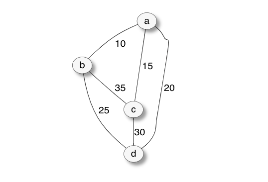

# Travelling Salesman Problem - Naive Solver

This Repo provides a naive solver for the [Travelling Salesman Problem](https://en.wikipedia.org/wiki/Travelling_salesman_problem).

The naive solution is based on the following three steps:

1. Generate all possible permutations of nodes
2. Iterate over each permutation and calculate path length
3. Return shortest path

The Repo also contains a naive solver for the decision version of the Travelling Salesman Problem. Given a path length L, the solver follows these steps:

1. generate all possible tours
2. check if the length of the tours is less than L, if yes then return true

## Usage

You can start by using the sample graph included in the code, like this:
```sh
node .
>.tsp A
{ path: [ 'A', 'B', 'D', 'C', 'A' ], length: 80 }
```
The above calculates the shortest path.

If you want use the solver for the decision version of the problem, simply run:
```sh
node .
> .dectsp 98
{ exists: true, path: [ 'A', 'B', 'C', 'D', 'A' ], length: 95 }
```

The included graph looks like this:



If you would like to experiment, you can specify your own graph updating v and g constants in index.js:
```javascript
const v = ['A', 'B', 'C', 'D'];

/*
 * The below is the representation of this graph:
 *
 *          10               15
 *    +-------------+ A +-------------+
 *    |               +               |
 *    |               |               |
 *    |               |20             |
 *    |               |               |
 *    |               |               |
 *    +     25        +      30       +
 *    B +-----------+ D +-----------+ C
 *    +                               +
 *    |                               |
 *    |                               |
 *    +-------------------------------+
 *                   35
 *
 */
const e = {
  AB: 10,
  AC: 15,
  AD: 20,
  BA: 10,
  BC: 35,
  BD: 25,
  CA: 15,
  CB: 35,
  CD: 30,
  DA: 20,
  DB: 25,
  DC: 30
};
```

